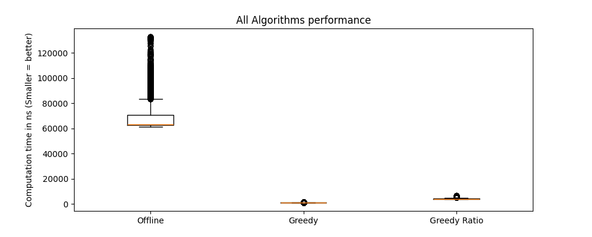

# De Algen : online-offline-algorithms

This codebase includes the [offline, online algorithms](./src/algorithms) described in the paper of the course Algorithms for Decision Support.
It also includes a [performance_test.py](./src/performance_test.py) module to run iteration of computational performance test and its average cost.
These performance measurements are plotted in box plots using [plotting.py](./src/plotting.py).

Instances that we used and others that can be run are located in the [instances](./instances) directory.
These instance text files are being read and parsed by our [parser](./src/instance_parser.py)

A preview of the general performance of our algorithms can be seen in a sampled plot.


If you wish to try your own instances, do the following:
1. Create a text file in the instances directory with your instance in the format :   
   ```text
   n  
   m  
   s,p,h (comma seperated) 
   s,p,h 
   ... 
   s,p,h (repeat for m rows)  
   ```
2. Go to the main script and add:  `run_test("your-instance-filename.txt")`
3. Run main.py and let the magic do its work

    